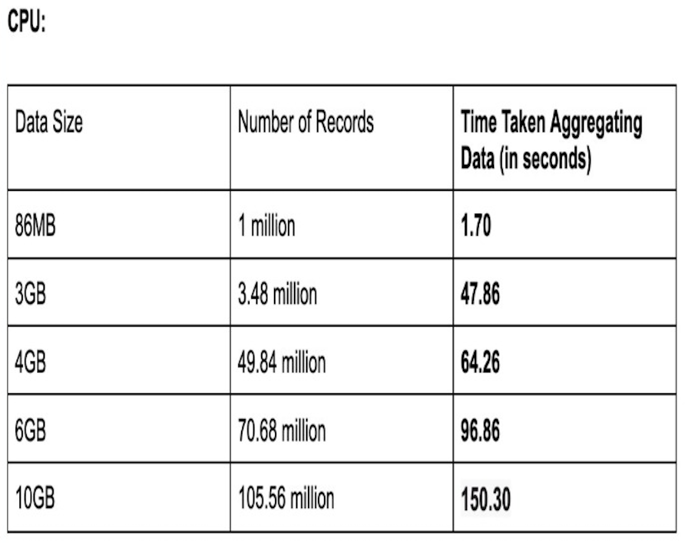
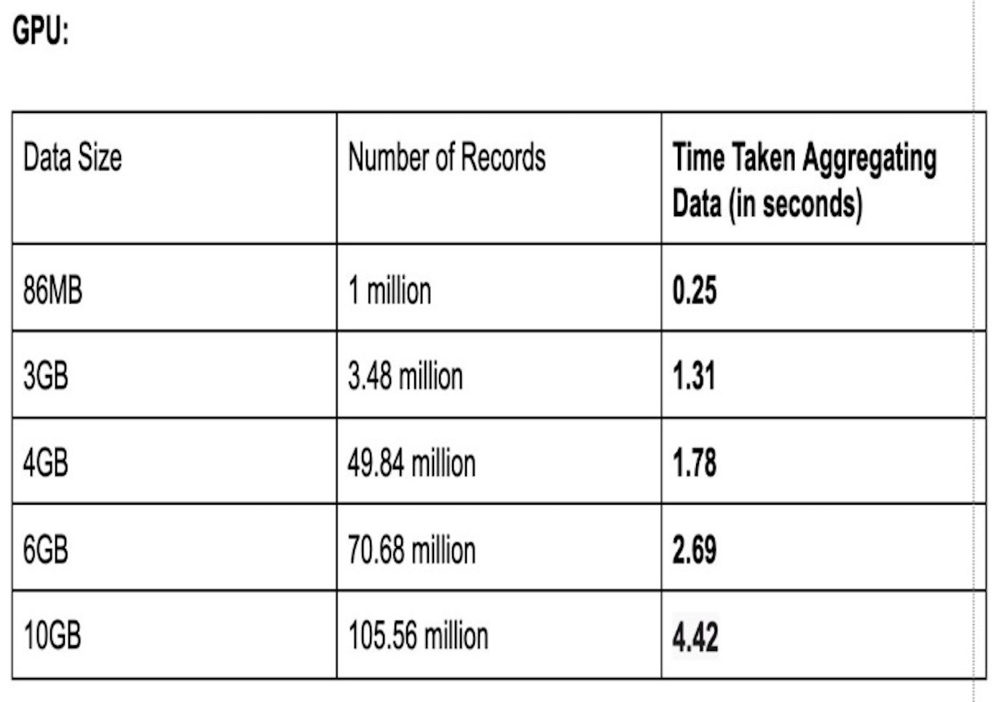
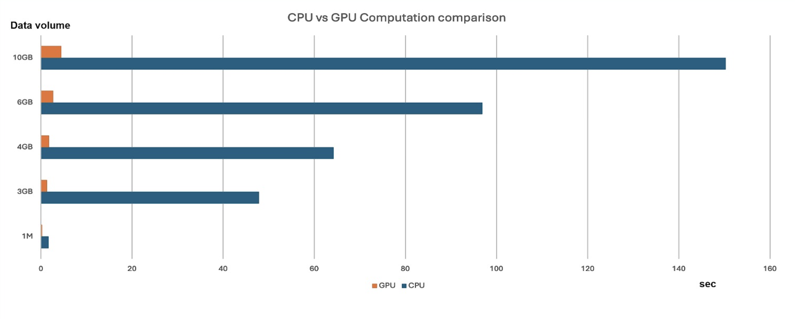

# Chunk-Based JSON Parsing System with GPU-Accelerated Aggregation and Hashing

## Problem Overview

In situations where the dataset is huge and computational resources (CPU and GPU) are utilised to manage the workload effectively, the challenge is to optimise the processing and aggregation of JSON data as it is widely used in contemporary applications as a structured data representation standard and the requirement is to manage massive amounts of JSON data effectively is very pertinent. Development teams must prioritise optimisation solutions since traditional single-threaded, CPU-only processing methods create bottlenecks as datasets get larger and more complicated.

This problem is highly relevant to real-world applications, including big data analytics, machine learning pipelines, real-time monitoring systems, and distributed log processing. By optimizing data aggregation, businesses can enhance speed, scalability, and reliability, addressing challenges across industries such as technology, e-commerce, healthcare, and finance.

## Method proposed

The project is organised in phases, with each phase building on the one before it to produce code that is increasingly optimised. Here is a summary of the techniques:

- Single-Threaded CPU Processing: The CPU reads the JSON file all at once. One thread is used to successively parse, flatten, traverse, and aggregate the data.
Expected Level of Optimisation: Basic, Though ineffective for bigger files, it works well for tiny datasets.

- Multi-Threaded CPU Processing: A thread is assigned to each of the pieces that make up the JSON file. Independently, each thread traverses, aggregates, flattens, and parses its piece. The outcomes are combined in the main thread.
Expected Level of Optimisation: Moderate, increases speed by using many CPU threads for simultaneous processing.

- CPU for Parsing and GPU for Aggregation: Each thread breaks up the JSON file into smaller pieces, processing each one to create flattened data files. The GPU receives these files for output and aggregation.
Expected Level of Optimisation: High, includes file I/O overhead but reduces CPU bottlenecks by offloading aggregation to the GPU.

- CPU Threads with Streaming to GPU: JSON chunks are processed by CPU threads, which then continually stream the flattened data into a queue. After reading the queue, the GPU aggregates and hashes the data and outputs the results.
Expected Level of Optimisation: Higher, it creates a real-time data stream between the CPU and GPU and eliminates file I/O overhead.

- Fully Parallel CPU-GPU Integration: Data is parsed and streamed into a queue by CPU threads and then processed in parallel by several GPU threads. The GPU buffer is used for aggregation, and the output is where the results are written.
Expected Level of Optimisation: Maximum, it enables the fastest and most effective processing by making full use of CPU and GPU parallelism.

### Flow Diagram

## Implementation

The implementation of the Chunk-Based JSON Parsing System with GPU-Accelerated Aggregation and Hashing was methodically divided into phases, each tailored to escalate the level of optimization progressively. Here are the specifics of the implementation carried out in different files across these phases:

### Single-Threaded CPU Processing:

- **File**: CPU_only_processing.cpp
- This initial phase involved straightforward, single-threaded processing of JSON data using the CPU. It served as a baseline by processing the entire JSON file serially to parse, flatten, and aggregate the data.

### CPU for Parsing and GPU for Aggregation:

- **Files**: cpu_without_multithreading.cpp and GPU_aggregation_without_threads.cu
- In this setup, the CPU is responsible for parsing the JSON data into manageable chunks which are then handed over to the GPU for efficient aggregation. This phase integrates basic GPU utilization to enhance data handling efficiency.

### Fully Parallel CPU-GPU Integration:

- **Files**: multithreading_in_cpu.cpp and GPU_aggregation_threads.cu
- Represents the culmination of the project's optimization efforts. This phase employs multiple CPU threads for parsing and multiple GPU threads for parallel data processing and aggregation. It maximizes the concurrency model by using both CPU and GPU resources efficiently.

The phased approach not only facilitated incremental improvements in handling large-scale JSON data but also provided clear insights into the benefits of integrating CPU and GPU for data-intensive applications. Each phase was designed to iteratively increase the complexity and efficiency of the system, ultimately leading to a robust solution capable of handling massive datasets with high performance.

### Dependencies:
- CMake (v3.10+)
- CUDA Toolkit
- nlohmann/json (for JSON parsing)
- POSIX Threads (for multithreading)

## Result and Analysis

This section presents the results obtained from the implementation of our Chunk-Based JSON Parsing System with GPU-Accelerated Aggregation and Hashing, highlighting the performance enhancements achieved through our multi-phased optimization approach.

### Benchmarking Results

Our benchmark tests were conducted across several data sizes, from 1MB to 10GB, to evaluate the performance of CPU versus GPU computations. The objective was to determine the effective scalability and efficiency of our system under different computational loads.

#### CPU vs GPU Computation Times

The benchmarking data clearly shows the advantages of GPU acceleration in handling large-scale data aggregation:

- **CPU Times:** As the data volume increased, the time taken by the CPU to aggregate data rose significantly, with the largest dataset (10GB) requiring approximately 150 seconds to process 105.56 million records.

  
  
- **GPU Times:** In stark contrast, the GPU demonstrated superior performance, processing the same 10GB dataset in just 4.42 seconds.
  
  

This substantial reduction in processing time illustrates the GPU's ability to handle parallel computations far more effectively than a CPU, particularly when dealing with large volumes of data.

#### Graphical Representation of CPU and GPU performance

The provided graphs further emphasize the disparity in performance between CPU and GPU. For instance, with a 10GB data load, the GPU was able to complete the aggregation nearly 34 times faster than the CPU. These results validate our approach of integrating GPU computing to tackle the challenges of large-scale data processing in modern applications.

## Advantages of GPU utilisation

In the context of the results obtained from our system's implementation, the GPU's role in accelerating data aggregation processes was demonstrated to be highly effective. The benchmarking data shows the substantial impact of GPU usage in reducing computation times, particularly when dealing with large data volumes.

Highlights from GPU Performance:
- Significant Reduction in Processing Time: As evidenced in the comparative analysis of CPU versus GPU computation, the GPU was capable of processing up to 10GB of data in just 4.42 seconds, compared to the CPU's 150 seconds for the same volume. This not only illustrates the GPU's superior parallel processing capabilities but also highlights its efficiency in handling large-scale datasets.

- Scalability and Efficiency: GPUs are inherently designed for high degrees of parallelism. This attribute was leveraged in our project to handle multiple operations simultaneously, a critical requirement for applications involving real-time data analysis and decision-making.

## Challenges We Faced

Initially, we planned to perform a roofline analysis to better understand the compute versus memory-bound characteristics of our tasks. However, this analysis could not be completed due to technical issues encountered with the profiling tools on our Windows systems. Specifically, we faced software bugs: some unexpected crashes and bugs in the profiling software hindered our ability to gather consistent data across all computational loads.

## Future Work

Future work for this project could involve incorporating distributed processing using multiple GPUs or a cluster of CPUs and GPUs could enable handling even larger datasets. Investigating memory optimization strategies, such as using asynchronous data transfers, could reduce latency further.

