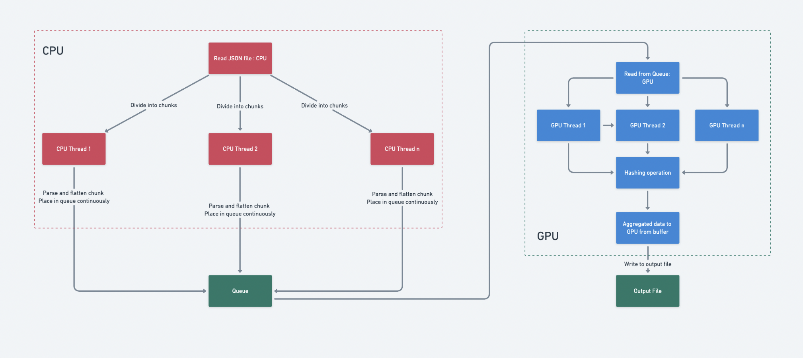

# Chunk-Based JSON Parsing and GPU-Accelerated Data Aggregation and Hashing System

## Problem Overview

In situations where the dataset is huge and computational resources (CPU and GPU) are utilised to manage the workload effectively, the challenge is to optimise the processing and aggregation of JSON data as it is widely used in contemporary applications as a structured data representation standard and the requirement is to manage massive amounts of JSON data effectively is very pertinent. Development teams must prioritise optimisation solutions since traditional single-threaded, CPU-only processing methods create bottlenecks as datasets get larger and more complicated.

This problem is highly relevant to real-world applications, including big data analytics, machine learning pipelines, real-time monitoring systems, and distributed log processing. By optimizing data aggregation, businesses can enhance speed, scalability, and reliability, addressing challenges across industries such as technology, e-commerce, healthcare, and finance.

## Method proposed

The project is organised in phases, with each phase building on the one before it to produce code that is increasingly optimised. Here is a summary of the techniques:

- Single-Threaded CPU Processing: The CPU reads the JSON file all at once. One thread is used to successively parse, flatten, traverse, and aggregate the data.
Expected Level of Optimisation: Basic, Though ineffective for bigger files, it works well for tiny datasets.

- Multi-Threaded CPU Processing: A thread is assigned to each of the pieces that make up the JSON file. Independently, each thread traverses, aggregates, flattens, and parses its piece. The outcomes are combined in the main thread.
Expected Level of Optimisation: Moderate, increases speed by using many CPU threads for simultaneous processing.

- CPU for Parsing and GPU for Aggregation: Each thread breaks up the JSON file into smaller pieces, processing each one to create flattened data files. The GPU receives these files for output and aggregation.
Expected Level of Optimisation: High, includes file I/O overhead but reduces CPU bottlenecks by offloading aggregation to the GPU.

- CPU Threads with Streaming to GPU: JSON chunks are processed by CPU threads, which then continually stream the flattened data into a queue. After reading the queue, the GPU aggregates and hashes the data and outputs the results.
Expected Level of Optimisation: Higher, it creates a real-time data stream between the CPU and GPU and eliminates file I/O overhead.

- Fully Parallel CPU-GPU Integration: Data is parsed and streamed into a queue by CPU threads and then processed in parallel by several GPU threads. The GPU buffer is used for aggregation, and the output is where the results are written.
Expected Level of Optimisation: Maximum, it enables the fastest and most effective processing by making full use of CPU and GPU parallelism.

### Flow Diagram

## Roofline Analysis

Roofline analysis provides insights into whether the hashing and aggregation tasks are compute-bound or memory-bound. This is crucial in fine-tuning the CPU-GPU integration, optimizing CUDA kernels, or modifying memory access patterns to better utilize the hardware.

It will help us identify whether the bottleneck lies in:
- **Memory Bandwidth:** If the CPU-GPU data transfer or GPU memory access is limiting performance.
-** Compute Performance:** If the GPU is underutilized, leaving computational resources idle.

### How roofline analysis will be performed:

We will start by collecting key metrics such as FLOPs (floating-point operations per second), memory bandwidth, and will use tools like NVIDIA Nsight Compute for profiling GPU tasks (e.g., hashing and aggregation) and Intel Advisor for CPU tasks (e.g., parsing and flattening JSON). We will plot the theoretical roofline of the hardware, including the compute and memory bandwidth limits, and overlay the actual performance of the project tasks to identify whether they are memory-bound or compute-bound. 

## Advantages of GPU utilisation

In this project, the GPU plays a crucial role in accelerating the data aggregation process by offloading computationally intensive tasks from the CPU. GPUs are designed for parallelism, with thousands of smaller cores capable of handling multiple operations simultaneously. Once the CPU parses and flattens the JSON data, the GPU takes over the hashing and aggregation tasks, which involve repetitive calculations that can be parallelized effectively. By leveraging GPU acceleration, the project reduces latency, enhances throughput, and handles larger datasets more efficiently than CPU-only processing.

GPU multithreading allows each thread to process data chunks independently, ensuring real-time processing even with continuous data streams from the CPU. Multiple GPU threads read from the data queue, process chunks in parallel, and store results in a buffer for aggregation. This approach optimizes hardware utilization, making it ideal for real-time systems and large-scale pipelines.

## Future Work

Future work for this project could involve incorporating distributed processing using multiple GPUs or a cluster of CPUs and GPUs could enable handling even larger datasets. Investigating memory optimization strategies, such as using asynchronous data transfers, could reduce latency further.

